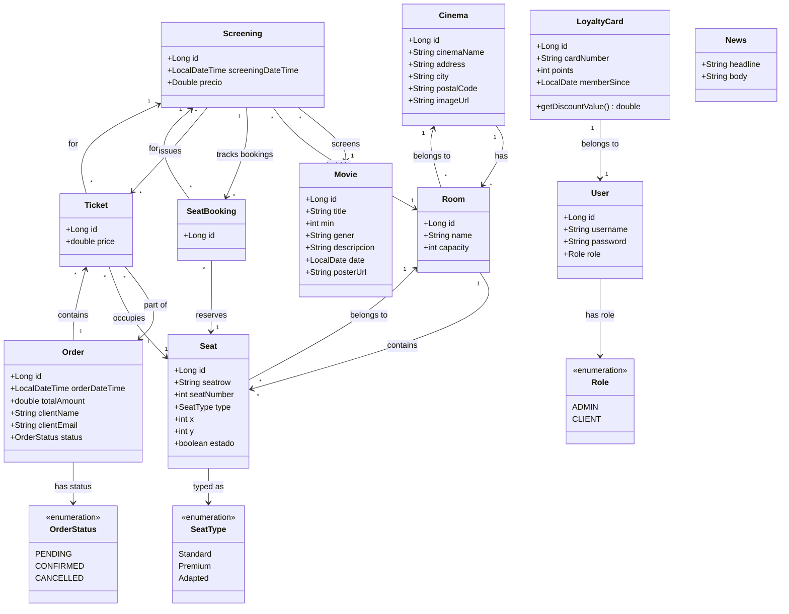
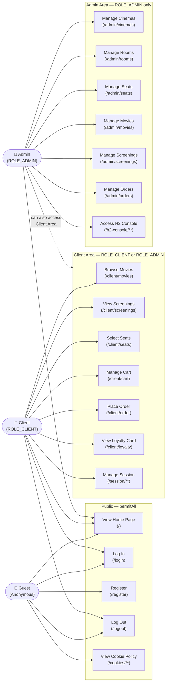

# CinemaDaw — Diagrams

## 1. Class Diagram

---

## 2. Use Case Diagram

> Actors and permissions are derived from `SecurityConfig.java`.  
> Specific use cases are inferred from the domain entities.

